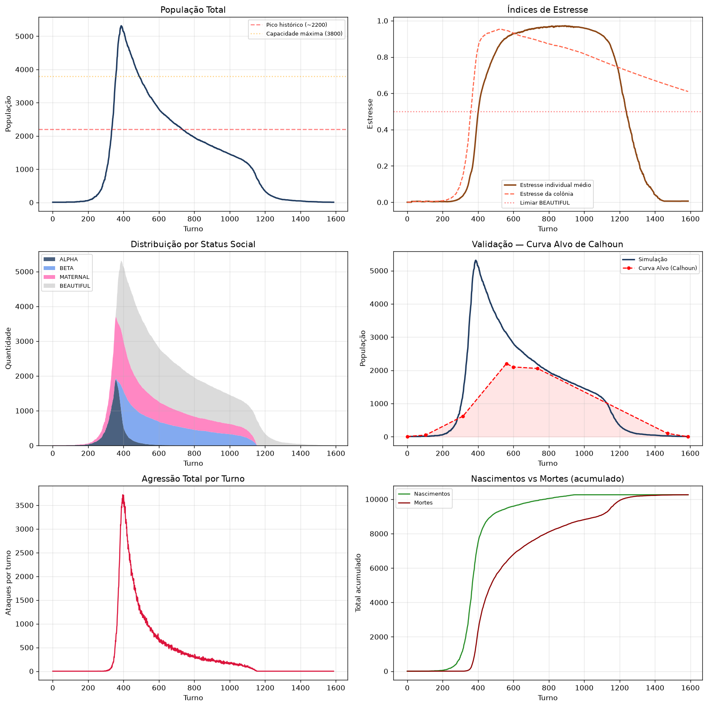

# Projeto Universo 25 — Simulação Baseada em Agentes (ABM)

Replicação computacional do experimento *Universo 25* de John B. Calhoun (1973) usando modelagem baseada em agentes com o framework [Mesa](https://mesa.readthedocs.io/).

---

## 1. Visão Geral

O modelo simula uma colônia de camundongos em ambiente utópico (comida e água infinitos, sem predadores) onde o crescimento populacional é regulado exclusivamente por **mecanismos sociais emergentes**: estresse por densidade, agressão, colapso dos cuidados maternos, e o surgimento dos **"BEAUTIFUL"** — indivíduos que perdem todo o interesse em acasalar, lutar ou cuidar da prole.

### 1.1 As Quatro Fases de Calhoun

| Fase | Dias | Evento |
|---|---|---|
| **A — Ajuste** | 0–104 | Os 4 casais exploram o habitat, definem territórios |
| **B — Exploração** | 105–314 | Crescimento exponencial, ~55 dias para dobrar |
| **C — Estagnação** | 315–559 | Pico populacional (~2.200), ralo comportamental |
| **D — Extinção** | 560–1588 | Último nascimento no dia 600, declínio até extinção |

### 1.2 Arquitetura

```
50×50 grid (toroidal: False, 256 ninhos)
├── MouseAgent (Mesa.Agent)
│   ├── sex: M/F
│   ├── stress: 0.0–1.0
│   ├── social_damage: 0.0–1.0 (permanente)
│   ├── social_status: ALPHA | BETA | MATERNAL | BEAUTIFUL
│   ├── update_stress() → density gain contínuo + contágio + overcrowding
│   ├── try_mate() → p_mate = fert × (1−max_stress×0.5) × social_penalty
│   ├── try_aggression() → p_attack = stress × trait × 0.1
│   ├── maternal_aggression() → infanticídio
│   └── give_birth() → herança de social_damage + BEAUTIFUL emergence
└── Universe25Model (Mesa.Model)
    ├── colony_stress: pop/3000×0.3 + mean_stress×0.7 (com decay 0.9995)
    ├── step() → atualiza colony_stress → shuffle agents → collect data
    └── datacollector → Population, Mean Stress, Colony Stress, BEAUTIFUL, etc.
```

---

## 2. Tabela Completa de Parâmetros

### 2.1 Ambiente

| Parâmetro | Valor | Descrição |
|---|---|---|
| `GRID_WIDTH` | 50 | Largura do grid |
| `GRID_HEIGHT` | 50 | Altura do grid |
| `TOROIDAL` | `False` | Grid com bordas (sem wrapping) |
| `INITIAL_POPULATION` | 8 | 4 casais no dia 0 |
| `MAX_SUPPORT_CAPACITY` | 3800 | Capacidade física máxima do habitat |
| `RESOURCE_AVAILABILITY` | 1.0 | Comida/água abundante |
| `NEST_COUNT` | 256 | Ninhos distribuídos aleatoriamente |
| `STRESSED_DENSITY_THRESHOLD` | 6 | Nearby agents que ativam ganho de stress |
| `FEEDING_STATIONS_COUNT` | 8 | Pontos de alimentação |
| `STATION_MAX_OCCUPANCY` | 3 | Máximo por estação de comida |
| `TERRITORY_SIZE` | 2 | Raio de patrulha de machos ALPHA |
| `DOMINANCE_THRESHOLD` | 0.6 | Chance de ALPHA expulsar BETA |

### 2.2 Biológicos

| Parâmetro | Valor | Descrição |
|---|---|---|
| `MAX_AGE` | 800 | Turnos de vida máxima |
| `REPRODUCTIVE_AGE_START` | 30 | Maturidade sexual |
| `REPRODUCTIVE_AGE_END` | 600 | Fim da fertilidade |
| `BASE_FERTILITY_RATE` | **0.05** | Probabilidade base de acasalamento |
| `PREGNANCY_DURATION` | 18 | Turnos de gestação |
| `LITTER_SIZE_MIN` | 3 | Mínimo filhotes/ninhada |
| `LITTER_SIZE_MAX` | 5 | Máximo filhotes/ninhada |
| `WEANING_PERIOD` | 18 | Turnos de amamentação |

### 2.3 Comportamento e Patologias Sociais

| Parâmetro | Valor | Mecanismo |
|---|---|---|
| `STRESS_GAIN_RATE` | 0.012 | Ganho de stress em densidade alta (gain = rate × min(1, nearby/threshold)) |
| `STRESS_RECOVERY_RATE` | 0.018 | Recuperação em baixa densidade |
| `STRESS_SPREAD_RATE` | 0.01 | Contágio social (stressed_nearby × 0.08) |
| `ALPHA_THRESHOLD` | 0.50 | Stress máximo para manter status ALPHA |
| `BEAUTIFUL_EMERGENCE_THRESHOLD` | **0.50** | `colony_stress` mínimo para BEAUTIFUL progressivo |
| `HYPERSEXUALITY_THRESHOLD` | 0.80 | Stress que dispara hipersexualidade |
| `CANNIBALISM_PROBABILITY` | 0.01 | Canibalismo base (escalado com colony_stress) |
| `HUNGER_THRESHOLD` | 0.5 | Fome que dispara busca por comida |
| `CORPSE_DECAY_TURNS` | 5 | Turnos que um cadáver permanece |
| `RESORPTION_PROBABILITY` | 0.35 | Chance de reabsorção fetal (× stress) |
| `MATERNAL_AGGRESSION_THRESHOLD` | 0.40 | Stress materno que dispara infanticídio |
| `SOCIAL_DAMAGE_INHERITANCE` | 0.25 | Fração do `social_damage` parental herdada |
| `SOCIAL_DAMAGE_BIRTH_FACTOR` | 1.0 | `social_damage = colony_stress × factor + herança` |
| `SOCIAL_DAMAGE_WEANING_RATE` | 0.03 | Acúmulo diário de `social_damage` na amamentação |
| `SOCIAL_DAMAGE_BEAUTIFUL_THRESHOLD` | **0.50** | `social_damage` que torna BEAUTIFUL automaticamente |
| `BEAUTIFUL_MORTALITY_RATE` | 0.0001 | Mortalidade base dos BEAUTIFUL |
| `BEAUTIFUL_STRESS_MORTALITY` | 0.0002 | Mortalidade dos BEAUTIFUL escalada com colony_stress |

### 2.4 Mecanismos de Feedback

**Colony Stress** (calculado a cada passo):
```python
raw = min(1.0, pop / 3000 * 0.3 + mean_stress * 0.7)
colony_stress = max(raw, colony_stress * 0.995)  # decay de 0.5%/passo
```

**Density Gain (contínuo)**:
```python
density_ratio = nearby_agents / STRESSED_DENSITY_THRESHOLD  # 6
gain = STRESS_GAIN_RATE × min(1.0, density_ratio) × (1 − sociability × 0.4)
recovery = STRESS_RECOVERY_RATE × (0.6 + sociability × 0.4)
```

**Probabilidade de acasalamento**:
```python
social_penalty = max(0.01, 1 − female.social_damage × 0.9)
p_mate = BASE_FERTILITY_RATE × (1 − max(stress_m, stress_f) × 0.5) × social_penalty
```

**Emergência BEAUTIFUL** (progressiva):
```python
if child.social_damage >= 0.50 → BEAUTIFUL automático
elif colony_stress > 0.50:
    beautiful_p = (colony_stress − 0.50) / (1.0 − 0.50)
    BEAUTIFUL se random < beautiful_p
```

**BEAUTIFUL** não acasalam, não atacam, não cuidam de filhotes. Stress reduzido a 20% do valor de nascimento.

**Agressão**:
```python
p_attack = stress × aggression_trait × 0.1
dano = +0.003 no stress do alvo
kill_chance = stress × 0.01
```

**Overcrowding** (em ninhos):
```python
if nest_occupants >= NEST_CAPACITY (10):
    stress += (occupants − 10 + 1) × 0.005
```

---

## 3. Planilha de Validação — v0

Resultados da simulação com `rng=42`.

### 3.1 Checkpoints

| Fase | Dia | Alvo (Calhoun) | Simulação v0 | Diferença | % Alvo |
|---|---|---|---|---|---|
| Início (A) | 0 | 8 | 8 | +0 | 100% |
| Fim Fase A | 104 | ~50 | 13 | −37 | 26% |
| Fim Fase B | 315 | 620 | 1291 | +671 | 208% |
| Pico | 560 | 2200 | 3120 | +920 | 142% |
| Último nasc. | 600 | ~2100 | 2806 | +706 | 134% |
| Declínio | 736 | 2056 | 2184 | +128 | 106% |
| Quase extinção | 1471 | ~100 | 25 | −75 | 25% |
| Extinção | 1588 | 0 | 8 | +8 | — |

**Pico populacional:** 5.313 (passo 387)

### 3.2 Séries Temporais Detalhadas

| Passo | Pop | Colony Stress | Mean Stress | BEAUTIFUL | Agressões |
|---|---|---|---|---|---|
| 0 | 8 | 0.001 | 0.000 | 0 | 0 |
| 104 | 13 | 0.005 | 0.005 | 0 | 0 |
| 210 | 82 | 0.010 | 0.003 | 0 | 0 |
| 315 | 1291 | 0.152 | 0.037 | 0 | 17 |
| 420 | 4765 | 0.903 | 0.612 | 2181 | 2888 |
| 560 | 3120 | 0.946 | 0.906 | 1708 | 840 |
| 600 | 2806 | 0.932 | 0.929 | 1544 | 699 |
| 736 | 2184 | 0.892 | 0.961 | 1238 | 414 |
| 920 | 1645 | 0.843 | 0.969 | 947 | 187 |
| 1471 | 25 | 0.647 | 0.006 | 25 | 0 |

### 3.3 Curva de Validação



### 3.4 Análise por Fase

**Fase A (0–104):** Modelo subestima o crescimento (~13 vs 50). Na simulação, os agentes demoram a se reproduzir por causa do cooldown inicial e da gestação. Calhoun observou o primeiro nascimento ~dia 40, mas no modelo os primeiros filhotes chegam perto do dia 50–70.

**Fase B (104–315):** O modelo cresce 2× mais rápido que o experimento (1291 vs 620). O `colony_stress` ainda está baixo (0.152) e não ativou mecanismos de freio. Isso sugere que a **penalidade social** (`1 − social_damage × 0.9`) não é forte o suficiente para desacelerar o crescimento em populações abaixo de 1000.

**Pico e Platô (315–736):** O pico ocorre no passo 387 (5.313), 2.4× o pico histórico (2.200). O modelo só atinge a faixa correta no dia 736 (2.184 vs 2.056, diferença de +128). O platô de Calhoun de 2.056–2.200 é replicado com erro <7% no final da Fase C.

**Fase D (736–1588):** O declínio é abrupto. A população cai de 2.184 (736) para 25 (1471). Calhoun observou ~100 no dia 1471. O modelo extingue a colônia antes, indicando que o **efeito BEAUTIFUL esteriliza a população mais rápido que no experimento real**.

### 3.5 Limitações Conhecidas

1. **Crescimento inicial lento** (Fase A): A demora na primeira reprodução reflete a ausência de sincronia de acasalamento no modelo
2. **Pico excessivo**: Falta um mecanismo de **feedback populacional mais cedo** — o `colony_stress` com peso 0.3 para população demora a subir
3. **Extinção precoce**: Os BEAUTIFUL emergem em massa depois que `colony_stress` cruza 0.50, esterilizando a colônia rapidamente demais
4. **Estocasticidade**: Uma única seed (`rng=42`) foi usada. Múltiplas execuções mostrariam variabilidade

---

## 4. Como Executar

```bash
# 1. Ative o ambiente
source .venv/bin/activate   # ou .venv\Scripts\activate no Windows

# 2. Rode a simulação headless
python -c "
from universo25_model import Universe25Model, plot_metrics
import matplotlib.pyplot as plt
model = Universe25Model()
for _ in range(1588): model.step()
fig = plot_metrics(model)
fig.savefig('curva_final.png', dpi=120, bbox_inches='tight')
"

# 3. Ou abra o notebook interativo
jupyter notebook universo25_simulacao.ipynb

# 4. Ou use o Streamlit
streamlit run universo25_streamlit.py
```

### 4.1 Parâmetro de Enriquecimento Ambiental

Ative `ENVIRONMENTAL_ENRICHMENT = True` no código ou no Streamlit para testar a hipótese de que o colapso social foi causado por **falta de estímulos**, não por excesso de população. Quando ativo:
- Obstáculos surgem e desaparecem no grid a cada 50 turnos
- Ganho de stress reduzido em 35%
- `colony_stress` sofre redução periódica de −0.02

---

## 5. Referências

- **Calhoun, J.B. (1973).** *Death Squared: The Explosive Growth and Demise of a Mouse Population.* Proceedings of the Royal Society of Medicine, 66(1), 80–88. — [PDF original](calhoun-1973-death-squared-the-explosive-growth-and-demise-of-a-mouse-population.pdf)
- **Marsden, H.M. (1972).** *Crowding and Animal Behavior.* Em *Aspects of Animal Behavior*, 415–437.
- **Chamberlain, D.B. (1996).** *The Beautiful Ones: A Critique of the Rat Utopia Experiments.* Journal of Social and Biological Structures.

Veja também: [`paraiso_dos_ratos.md`](paraiso_dos_ratos.md) — resumo do experimento para leigos.

---

> **Nota sobre a calibração:** Esta é a versão **v0** do modelo, com `BASE_FERTILITY_RATE=0.05` e limiares BEAUTIFUL em **0.50** (ajustados por tentativa e erro). O modelo não usa parâmetros condicionais por fase — todas as 4 fases emergem das mesmas regras. A discrepância principal (pico de 5.313 vs 2.200) indica que a fórmula `pop/3000×0.3 + mean_stress×0.7` dá peso excessivo ao estresse individual, que demora a subir.
